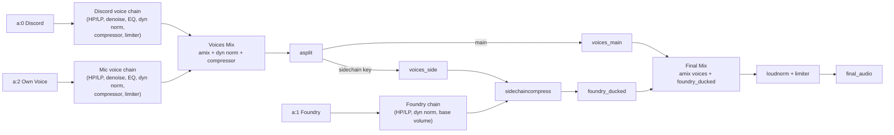

# OBS Video Pipeline

Automates post-processing for OBS recordings by date, keeps video stream copy-only, improves voice clarity, and can upload the final video to YouTube as `unlisted`.

## What It Does

- Collects `*$DATE*.mkv` from `~/Videos/OBS` in sorted order.
- Concatenates segments into `merged_YYYY-MM-DD.mkv` (`-c copy`).
- Processes audio once for the full session into `processed_audio_YYYY-MM-DD.m4a`.
- Remuxes final MP4:
  - `DSA5 mit Marth DD.MM.YYYY final.mp4`
  - Video: `-c:v copy`
  - Audio: processed AAC track (`-c:a copy` at remux stage)
  - `-movflags +faststart`
- Uploads the final MP4 to YouTube as `unlisted` (optional stage).

## Audio Model (Strict, No Fallback)

The merged file must contain exactly 3 audio streams:

- `a:0` = Discord (other voices)
- `a:1` = Foundry (ambience/music)
- `a:2` = Own mic voice

If stream count is not exactly 3, the script exits with an error.

## Mix Profiles

- `balanced` (default): clear voices, moderate foundry ducking.
- `voice-priority`: stronger voice enhancement and stronger foundry ducking.

Set with `-m`, for example:

```bash
./process_videos.sh -m voice-priority 2026-03-06
```

## Audio Filter Graph (`filter_complex`)

The graph topology is identical for both profiles; only parameter intensity changes.



Profile differences:

- `balanced`: moderate ducking, more ambience/music retention.
- `voice-priority`: stronger ducking and stronger speech-forward processing.

### Detailed Node-to-Filter Mapping

| Graph Node | Stream | Filter chain (order) | Profile difference |
|---|---|---|---|
| `DPROC` | `a:0` Discord | `aformat -> highpass -> lowpass -> afftdn -> equalizer x3 -> dynaudnorm -> acompressor -> alimiter` | `voice-priority` uses slightly stronger denoise/EQ/dynamics |
| `VPROC` | `a:2` Own voice | `aformat -> highpass -> lowpass -> afftdn -> equalizer x3 -> dynaudnorm -> acompressor -> alimiter` | `voice-priority` pushes speech presence/compression more |
| `VMIX` | Discord + Mic | `amix -> dynaudnorm -> acompressor -> volume` | `voice-priority` keeps voices slightly louder |
| `SPLIT` | Voices bus | `asplit=2` | same |
| `FPROC` | `a:1` Foundry | `aformat -> highpass -> lowpass -> dynaudnorm -> volume` | `voice-priority` keeps foundry lower overall |
| `DUCK` | Foundry ducking | `sidechaincompress(foundry, voices_side)` | `voice-priority` uses lower threshold + higher ratio + longer release |
| `FINALMIX` | Voices + ducked foundry | `amix` | same topology, different relative levels from upstream |
| `FINALPROC` | Master bus | `loudnorm -> alimiter` | `voice-priority` targets louder speech-forward master |

Notes:

- EQ bands are tuned to reduce mud (`~180-200 Hz`) and improve intelligibility (`~3-6.5 kHz`).
- Ducking trigger is the voice sidechain bus, so ambience/music recovers when nobody speaks.

## Stages

- `concat`
- `audio`
- `video`
- `upload`
- `clean`

Default order if `-e` is not provided:

```text
concat,audio,video,clean
```

## Usage

- Full default pipeline:
  - `./process_videos.sh 2026-03-06`
- Full pipeline including upload:
  - `./process_videos.sh -e concat,audio,video,upload,clean 2026-03-06`
- Build locally without upload:
  - `./process_videos.sh -e concat,audio,video,clean 2026-03-06`
- Audio only:
  - `./process_videos.sh -e audio -m balanced 2026-03-06`
- Video only:
  - `./process_videos.sh -e video 2026-03-06`
- Upload only:
  - `./process_videos.sh -e upload 2026-03-06`
- Set ffmpeg threads:
  - `./process_videos.sh -T 6 2026-03-06`

## YouTube Upload Setup (Google API)

The pipeline uses:

- `yt_upload.sh` (wrapper)
- `yt_upload.py` (official YouTube Data API v3 client)

### 1) Install local Python dependencies

```bash
python3 -m venv .venv-youtube-upload
.venv-youtube-upload/bin/pip install google-api-python-client google-auth-oauthlib google-auth-httplib2
```

### 2) Create OAuth client secrets

- In Google Cloud Console:
  - enable YouTube Data API v3
  - create OAuth client credentials of type `Desktop app`
  - download JSON

Place it at:

```text
~/.config/yt-upload/client_secrets.json
```

On first upload, OAuth login runs and token is stored at:

```text
~/.config/yt-upload/token.json
```

### 3) Run upload stage

```bash
./process_videos.sh -e upload 2026-03-06
```

Optional extra uploader args (passed through to `yt_upload.py`) as newline-separated items:

```bash
export YOUTUBE_UPLOAD_EXTRA_ARGS=$'--client-secrets\n~/.config/yt-upload/client_secrets.json\n--token-file\n~/.config/yt-upload/token.json\n--tags\ndsa5,pen-and-paper'
```

Convenience env vars for tags and playlist:

```bash
export YOUTUBE_UPLOAD_TAGS="dsa5,pen-and-paper,archiv"
export YOUTUBE_UPLOAD_PLAYLIST_ID="PLxxxxxxxxxxxxxxxx"
export YOUTUBE_UPLOAD_PLAYLIST_POSITION="0"   # optional
```

Then run upload:

```bash
./process_videos.sh -e upload 2026-03-06
```

Scope behavior:

- Upload without playlist requests only `youtube.upload`.
- If `--playlist-id` / `YOUTUBE_UPLOAD_PLAYLIST_ID` is used, uploader requests an additional YouTube scope and may ask for OAuth consent again.

## Inputs and Outputs

- Input:
  - `~/Videos/OBS/*.mkv`
- Output (`~/Videos/OBS/final/`):
  - `merged_YYYY-MM-DD.mkv`
  - `processed_audio_YYYY-MM-DD.m4a`
  - `filelist_mkv.txt`
  - `DSA5 mit Marth DD.MM.YYYY final.mp4`
  - `full_pipeline_YYYY-MM-DD_*.log`

## Quality & Security Guardrails

- Commit signing via SSH key is enabled.
- `main` branch is protected on GitHub (review required, no force-push/delete).
- Pre-commit hook at `.githooks/pre-commit` (when enabled with `git config core.hooksPath .githooks`) enforces:
  - `shellcheck`
  - `shfmt -d -i 2 -ci`
- Enable hook path locally:
  - `git config core.hooksPath .githooks`

## Notes

- `clean` removes workflow artifacts for the selected date and keeps the final MP4.
- `-c` disables cleanup even if `clean` stage is in the list.
- `-s` triggers shutdown after completion.
- `-n` sends a desktop notification after completion.
