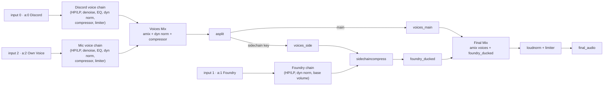

# OBS Video Pipeline

Automates post-processing for OBS recordings by date, improves voice clarity, encodes a YouTube-friendly CPU-x264 final video, and can upload it as `unlisted`.

## Requirements

- Linux with Bash 4 or newer, `/proc`, and GNU userland (`date -d`, `find -print0`, `sort -z`, `stat`)
- `systemd-inhibit` to prevent automatic suspend or hibernation during processing without keeping the displays awake
- `flock` from util-linux for per-date pipeline locking and race-free runtime shutdown control
- A recent FFmpeg build providing `ffmpeg`, `ffprobe`, `libx264`, `loudnorm`, `sidechaincompress`, and the AAC encoder
- Enough free space for the merged MKV, processed audio, and final MP4 during a full run
- Optional desktop/system integration:
  - `notify-send` for `-n`
  - `systemctl` with permission to power off for `-s`
- Python 3.10 or newer plus the packages in `requirements.txt` for YouTube uploads

## What It Does

- Collects `*$DATE*.mkv` from `~/Videos/OBS` in sorted order.
- Concatenates segments into `merged_YYYY-MM-DD.mkv` (`-c copy`).
- Processes audio once for the full session into 48-kHz AAC at `processed_audio_YYYY-MM-DD.m4a`.
- Encodes the final MP4:
  - `DSA5 mit Marth DD.MM.YYYY final.mp4`
  - Video: CPU `libx264`, preset `medium`, CRF 21, source resolution and frame rate
  - YouTube-oriented H.264 High Profile, 4:2:0, BT.709, two B-frames, closed GOP
  - Audio: processed 48-kHz AAC track (`-c:a copy` at video stage)
  - `-movflags +faststart`
- Uploads the final MP4 to YouTube as `unlisted` (optional stage).

Every non-dry-run invocation executes under a blocking `systemd-inhibit` lock for
`sleep`. This keeps long audio processing, CPU encoding, uploads, and cleanup from
being paused by automatic suspend or hibernation. Idle behavior is deliberately
not inhibited, so the screen saver, screen lock, and monitor power saving may
still activate. Shutdown is also not blocked, so `-s` can power off the computer
after a successful run.

Only one real pipeline may process a given date at a time. A second invocation
for the same date exits with status 75 instead of touching that workflow's media
artifacts. Pipelines for other dates, dry-runs, and `-S` shutdown-control calls
remain available concurrently. The small `.pipeline_YYYY-MM-DD.lock` file is
persistent; the operating-system lock itself is released automatically when the
pipeline exits.

FFmpeg encoding and YouTube upload progress remain visible in the terminal but
bypass `full_pipeline_*.log`. Normal status messages, successful upload details,
warnings, and errors continue to be written to the log.

Media outputs are written to private, owner-writable temporary files in the output directory and replace an existing target only after the corresponding copy, encode, or remux succeeds. Publication then applies the current `umask`; a single-segment copy retains the source permissions masked by `umask`, and replacements preserve the existing target mode, ownership/group, access ACL, and extended attributes. Existing output targets must be regular files; directories, special files, and symbolic links are rejected. If existing metadata cannot be preserved, publication fails and leaves the old target untouched.

## Audio Model (Strict, No Fallback)

The merged file must contain exactly 3 audio streams:

- `a:0` = Discord (other voices)
- `a:1` = Foundry (ambience/music)
- `a:2` = Own mic voice

During audio processing, the merged MKV is opened independently for each track. This keeps the three decoder/demuxer states isolated and prevents a secondary OBS/Opus track from silently disappearing in long `amix` or `sidechaincompress` runs.

If stream count is not exactly 3, the script exits with an error.

## Mix Profiles

- `balanced` (default): clear voices, moderate foundry ducking.
- `voice-priority`: stronger voice enhancement and stronger foundry ducking.

Set with `-m`, for example:

```bash
./process_videos.sh -m voice-priority 2026-03-06
```

## Video Encoding

The production `video` stage rebuilds the OBS/VAAPI video with CPU `libx264`.
The defaults favor a high-quality overnight encode and a smaller upload:

- preset `medium`
- CRF 21 variable-quality encoding without a bitrate cap
- original resolution and frame rate, forced to constant frame pacing
- H.264 High Profile, progressive 8-bit `yuv420p`, CABAC, and two B-frames
- closed GOP with a maximum length of half the frame rate
- BT.709 limited-range signaling for SDR
- processed AAC audio copied without another lossy encode

Override preset and CRF for an individual run with `-p` and `-q`. Supported
presets range from `superfast` through `placebo`; `ultrafast` is excluded because
it does not satisfy the enforced H.264 High Profile contract. CRF must be an
integer from 1 through 51 because lossless CRF 0 is incompatible with that
contract. Slower presets mainly improve compression efficiency; a smaller CRF
increases quality and file size. The defaults are the recommended production
settings.

### Benchmarking x264 settings

`benchmark_x264.sh` compares the production settings with alternative x264
thread, lookahead, preset, and CRF configurations on short excerpts of an
existing OBS recording. It never changes the source or a production output.
Each run writes encoded samples plus `results.csv` and `summary.csv` to a new
result directory. VMAF is measured against the original OBS video. The summary
also reports CPU use relative to all logical CPUs and estimates the complete
recording's video-only output size from the samples. The separately processed
audio track and MP4 container overhead are not included in that estimate.

Preview the default test plan:

```bash
./benchmark_x264.sh -d "/home/user/Videos/OBS/2026-03-06 19-00-00.mkv"
```

Run it immediately, or wait for an existing process first:

```bash
./benchmark_x264.sh "/home/user/Videos/OBS/2026-03-06 19-00-00.mkv"
./benchmark_x264.sh -w 12345 "/home/user/Videos/OBS/2026-03-06 19-00-00.mkv"
```

The default `throughput` profile compares thread and preset behavior. The
`quality` profile compares CRF 18, 20, 21, 22, and 24 with preset `medium`:

```bash
./benchmark_x264.sh -P quality "/home/user/Videos/OBS/2026-03-06 19-00-00.mkv"
```

The benchmark automatically inhibits suspend and hibernation while waiting and
running, without keeping the displays awake. Defaults are three 60-second
samples at `00:20:00`, `01:20:00`, and `02:30:00`; override them with `-a` and
`-t`. Do not run the benchmark in parallel with a production encode because
that would invalidate timing and CPU measurements.

## Audio Filter Graph (`filter_complex`)

Profile filter files live in `filters/`:

- `filters/balanced.fffilter`
- `filters/voice-priority.fffilter`

The graph topology is identical for both profiles; only parameter intensity changes.


```mermaid
flowchart LR
  A0["input 0 · a:0 Discord"] --> DPROC["Discord voice chain\n(HP/LP, denoise, EQ, dyn norm,\ncompressor, limiter)"]
  A2["input 2 · a:2 Own Voice"] --> VPROC["Mic voice chain\n(HP/LP, denoise, EQ, dyn norm,\ncompressor, limiter)"]
  DPROC --> VMIX["Voices Mix\namix + dyn norm + compressor"]
  VPROC --> VMIX

  VMIX --> SPLIT["asplit"]
  SPLIT -->|main| VMAIN["voices_main"]
  SPLIT -->|sidechain key| VSIDE["voices_side"]

  A1["input 1 · a:1 Foundry"] --> FPROC["Foundry chain\n(HP/LP, dyn norm, base volume)"]
  FPROC --> DUCK["sidechaincompress"]
  VSIDE --> DUCK
  DUCK --> FDUCK["foundry_ducked"]

  VMAIN --> FINALMIX["Final Mix\namix voices + foundry_ducked"]
  FDUCK --> FINALMIX
  FINALMIX --> FINALPROC["loudnorm + limiter"]
  FINALPROC --> OUT["final_audio"]
```

Profile differences:

- `balanced`: moderate ducking, more ambience/music retention.
- `voice-priority`: stronger ducking and stronger speech-forward processing.

### Detailed Node-to-Filter Mapping

| Graph Node | Stream | Filter chain (order) | Profile difference |
|---|---|---|---|
| `DPROC` | `a:0` Discord | `aformat -> highpass -> lowpass -> afftdn -> equalizer x3 -> dynaudnorm -> acompressor -> alimiter` | `voice-priority` uses slightly stronger denoise/EQ/dynamics |
| `VPROC` | `a:2` Own voice | `aformat -> highpass -> lowpass -> afftdn -> equalizer x3 -> dynaudnorm -> acompressor -> alimiter` | `voice-priority` pushes speech presence/compression more |
| `VMIX` | Discord + Mic | `amix -> dynaudnorm -> acompressor -> volume` | `voice-priority` keeps voices slightly louder |
| `SPLIT` | Voices bus | `asplit=2` | same |
| `FPROC` | `a:1` Foundry | `aformat -> highpass -> lowpass -> dynaudnorm -> volume` | `voice-priority` keeps foundry lower overall |
| `DUCK` | Foundry ducking | `sidechaincompress(foundry, voices_side)` | `voice-priority` uses lower threshold + higher ratio + longer release |
| `FINALMIX` | Voices + ducked foundry | `amix` | same topology, different relative levels from upstream |
| `FINALPROC` | Master bus | `loudnorm -> alimiter` | `voice-priority` targets louder speech-forward master |

Notes:

- EQ bands are tuned to reduce mud (`~180-200 Hz`) and improve intelligibility (`~3-6.5 kHz`).
- Ducking trigger is the voice sidechain bus, so ambience/music recovers when nobody speaks.

## Stages

- `concat`
- `audio`
- `video`
- `upload`
- `clean`

Default order if `-e` is not provided:

```text
concat,audio,video,clean
```

`-e` selects a set of stages; supplied names do not change the fixed execution
order shown above. Explicitly selected stages always run. Missing or older
prerequisites are added automatically: the script compares the selected OBS MKV
timestamps with `merged`, processed audio, and the final MP4, and also compares
each existing intermediate with its downstream output. After `clean`, a final
MP4 remains directly uploadable while it is at least as new as every matching
OBS source. Timestamp checks do not detect content changes that preserve an
existing file's modification time.

All segments selected for concat must have compatible stream layouts, codecs,
and recording parameters. If a pipeline for the same date is already active, a
second real invocation is rejected instead of waiting or running concurrently.

## Usage

- Full default pipeline:
  - `./process_videos.sh 2026-03-06`
- Full pipeline including upload:
  - `./process_videos.sh -e concat,audio,video,upload,clean 2026-03-06`
- Build locally without upload:
  - `./process_videos.sh -e concat,audio,video,clean 2026-03-06`
- Audio only:
  - `./process_videos.sh -e audio -m balanced 2026-03-06`
- Video only:
  - `./process_videos.sh -e video 2026-03-06`
- Upload only:
  - `./process_videos.sh -e upload 2026-03-06`
- Show planned stages without writing files:
  - `./process_videos.sh -d -e upload 2026-03-06`
- Set ffmpeg threads:
  - `./process_videos.sh -T 6 2026-03-06`
- Override CPU encoding for one run:
  - `./process_videos.sh -p medium -q 20 2026-03-06`
- Keep intermediate artifacts for inspection or reuse:
  - `./process_videos.sh -c 2026-03-06`

## Runtime Shutdown Control

A pipeline started with `-s` can have its final shutdown changed while audio
processing, encoding, or uploading is still running. Use the same recording date:

```bash
# Keep the computer running when the pipeline finishes
./process_videos.sh -S disable 2026-03-06

# Arm the final shutdown again
./process_videos.sh -S enable 2026-03-06

# Show the current state and pipeline PID
./process_videos.sh -S status 2026-03-06
```

The control state is tied to the active pipeline process and is read again just
before the final action. It is removed when the pipeline exits. A missing,
invalid, or stale control state cancels shutdown rather than risking an unwanted
poweroff. Runtime control is available only for runs originally started with
`-s`.

## YouTube Upload Setup (Google API)

The pipeline uses:

- `yt_upload.sh` (wrapper)
- `yt_upload.py` (official YouTube Data API v3 client)

### 1) Install local Python dependencies

```bash
python3 -m venv .venv-youtube-upload
.venv-youtube-upload/bin/pip install --requirement requirements.txt
```

### 2) Create OAuth client secrets

- In Google Cloud Console:
  - enable YouTube Data API v3
  - create OAuth client credentials of type `Desktop app`
  - download JSON

Place it at:

```text
~/.config/yt-upload/client_secrets.json
```

On first upload, OAuth login runs and token is stored at:

```text
~/.config/yt-upload/token.json
```

If the machine should print the authorization URL without attempting to launch a browser, pass `--no-browser` through the extra arguments:

```bash
export YOUTUBE_UPLOAD_EXTRA_ARGS="--no-browser"
```

### 3) Run upload stage

```bash
./process_videos.sh -e upload 2026-03-06
```

Optional extra uploader args (passed through to `yt_upload.py`) as newline-separated items:

```bash
export YOUTUBE_UPLOAD_EXTRA_ARGS=$'--client-secrets\n~/.config/yt-upload/client_secrets.json\n--token-file\n~/.config/yt-upload/token.json\n--tags\ndsa5,pen-and-paper'
```

Convenience env vars for tags and playlist:

```bash
export YOUTUBE_UPLOAD_TAGS="dsa5,pen-and-paper,archiv"
export YOUTUBE_UPLOAD_PLAYLIST_ID="PLxxxxxxxxxxxxxxxx"
export YOUTUBE_UPLOAD_PLAYLIST_POSITION="0"   # optional
```

Then run upload:

```bash
./process_videos.sh -e upload 2026-03-06
```

Scope behavior:

- Upload without playlist requests only `youtube.upload`.
- If `--playlist-id` / `YOUTUBE_UPLOAD_PLAYLIST_ID` is used, uploader requests an additional YouTube scope and may ask for OAuth consent again.

Uploads use resumable chunks and retry temporary network and HTTP 5xx failures with exponential backoff. Playlist positions are validated as zero-based unsigned 32-bit values before upload. If the video upload succeeds but playlist insertion fails, the uploader exits with the dedicated status `3` and prints the existing video ID. Status `2` remains available for command-line parsing errors. Do not rerun the complete upload after status `3`.

### Upload configuration

| Variable | Purpose | Default |
|---|---|---|
| `YOUTUBE_UPLOAD_DESCRIPTION` | Video description | `Archivaufnahme einer DSA5-Runde.` |
| `YOUTUBE_UPLOAD_TAGS` | Comma-separated tags | empty |
| `YOUTUBE_UPLOAD_PLAYLIST_ID` | Playlist receiving the uploaded video | empty |
| `YOUTUBE_UPLOAD_PLAYLIST_POSITION` | Optional zero-based playlist insertion index (`0`–`4294967295`) | empty |
| `YOUTUBE_UPLOAD_EXTRA_ARGS` | Newline-separated arguments for `yt_upload.py` | empty |
| `YOUTUBE_UPLOAD_BIN` | Alternative upload command used by the pipeline | `./yt_upload.sh` |
| `YT_UPLOAD_PYTHON` | Python executable used by `yt_upload.sh` | `.venv-youtube-upload/bin/python3` |
| `AUDIO_MIX_PROFILE` | Default mix profile when `-m` is omitted | `balanced` |
| `VIDEO_X264_PRESET` | Default CPU-x264 preset when `-p` is omitted | `medium` |
| `VIDEO_X264_CRF` | Default CPU-x264 CRF when `-q` is omitted | `21` |

## Inputs and Outputs

- Input:
  - `~/Videos/OBS/*.mkv`
- Output (`~/Videos/OBS/final/`):
  - `merged_YYYY-MM-DD.mkv` (intermediate; removed by the default `clean` stage)
  - `processed_audio_YYYY-MM-DD.m4a` (intermediate; removed by default)
  - `filelist_mkv_YYYY-MM-DD.txt` (multiple segments only; removed by default)
  - `DSA5 mit Marth DD.MM.YYYY final.mp4`
  - `full_pipeline_YYYY-MM-DD_*.log`
  - `.pipeline_YYYY-MM-DD.lock` (persistent per-date lock file; negligible size)

## Quality & Security Guardrails

- Dry-run control-flow tests:
  - `./tests/test_process_videos.sh`
- Media pipeline smoke tests:
  - `./tests/test_media_pipeline.sh`
- Uploader unit tests:
  - `.venv-youtube-upload/bin/python3 -m unittest tests/test_yt_upload.py`
- GitHub Actions runs syntax, lint, formatting, control-flow, media, and uploader tests.
- `main` branch is protected on GitHub (review required, no force-push/delete).
- Pre-commit hook at `.githooks/pre-commit` (when enabled with `git config core.hooksPath .githooks`) enforces:
  - `shellcheck`
  - `shfmt -d -i 2 -ci`
- Enable hook path locally:
  - `git config core.hooksPath .githooks`

## Notes

- `clean` removes current intermediate artifacts for the selected date and legacy shared concat lists, but keeps the final MP4 and logs.
- `-c` disables cleanup even if `clean` stage is in the list.
- `-s` triggers shutdown after completion.
- CPU video encoding can take several hours; shutdown runs only after every selected stage succeeds.
- Real pipeline runs automatically inhibit suspend and hibernation until completion; screen savers and monitor power saving remain available, and dry-runs do not acquire an inhibitor.
- Concurrent real runs for the same date fail with status 75; other dates, dry-runs, and runtime shutdown control are unaffected.
- `-n` sends a desktop notification after completion.
- If both `-s` and `-n` are supplied, shutdown takes precedence regardless of option order.
- Exactly one positional date argument is accepted.
